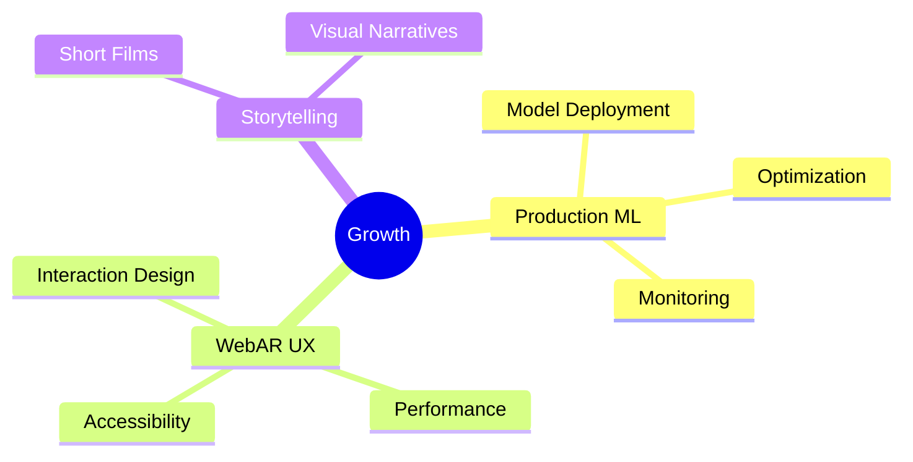

<div align="center">

# 👋 Hi, I'm Aakash


</div>

<div align="center">
  
[](https://3d-showcase-ten.vercel.app/)
[](https://github.com/Alexrusso3108)
[](https://www.linkedin.com/in/your-linkedin)
[](mailto:your.email@example.com)

</div>

---

<div align="center">

### 🚀 About Me

*I build playful, useful things at the intersection of*  
**AR • Computer Vision • Web Engineering**

</div>

```ascii
     ╔═══════════════════════════════════════╗
     ║  Shipping small end-to-end projects   ║
     ║  that people can try in a browser     ║
     ║  — not just demos on a laptop         ║
     ╚═══════════════════════════════════════╝
```


## 🔭 Currently Building

<table>
  <tr>
    <td width="50%">
      
### 👋 AR Sign Language Tutor
Real-time hand sign recognition with instant feedback. Built with Mediapipe & TensorFlow.js for browser-based learning.

**Tech:** WebAR • Mediapipe • TF.js  
**Goal:** Accessible practice without heavy installs

    </td>
    <td width="50%">
      
### 🧠 AR Memory Game
Browser-based memory challenges with 3D overlays. Simple UX designed for Alzheimer's patients and older users.

**Tech:** Three.js • WebXR • React  
**Purpose:** Cognitive aid through AR

    </td>
  </tr>
</table>


## 🛠️ Tech Stack

<div align="center">

### Languages & Frameworks


### AI & Computer Vision


### Tools & Platforms


</div>


## 🎨 Featured Projects

<div align="center">

### 🌐 [3D Interactive Showcase](https://3d-showcase-ten.vercel.app/)
*Click through and play with 3D models directly in your browser*

</div>

<table>
  <tr>
    <td width="33%" align="center">
      
      <br />
      <strong>🤟 AR Sign Language Tutor</strong>
      <br />
      <sub>Real-time hand recognition</sub>
    </td>
    <td width="33%" align="center">
      
      <br />
      <strong>🎮 AR Memory Game</strong>
      <br />
      <sub>Cognitive training tool</sub>
    </td>
    <td width="33%" align="center">
      
      <br />
      <strong>♻️ Garbage Classifier</strong>
      <br />
      <sub>CV-powered waste sorting</sub>
    </td>
  </tr>
</table>

<div align="center">
  <sub>📸 <i>Upload preview GIFs to</i> <code>assets/</code> <i>folder in your profile repo</i></sub>
</div>


## 📊 GitHub Stats

<div align="center">
  
  
</div>

<div align="center">
  
</div>

<div align="center">
  
</div>


## 🌱 Currently Learning

<div align="center">



</div>

- 🚀 Production-grade ML deployment strategies
- 🥽 Advanced WebAR user experience patterns
- 🎬 Visual storytelling through short films


## 💭 Design Philosophy

<div align="center">

> *"Ship small end-to-end projects that people can try in a browser*  
> *— not just demos on a laptop."*

</div>

<table align="center">
  <tr>
    <td align="center" width="25%">
      
      <br />
      <strong>Accessible</strong>
      <br />
      <sub>Browser-first experiences</sub>
    </td>
    <td align="center" width="25%">
      
      <br />
      <strong>Playful</strong>
      <br />
      <sub>Engaging interactions</sub>
    </td>
    <td align="center" width="25%">
      
      <br />
      <strong>Useful</strong>
      <br />
      <sub>Solving real problems</sub>
    </td>
    <td align="center" width="25%">
      
      <br />
      <strong>Iterative</strong>
      <br />
      <sub>Ship and improve</sub>
    </td>
  </tr>
</table>


## 🤝 Let's Connect

<div align="center">

I love collaborating on projects that blend **technology, creativity, and purpose**.  
If you're working on AR/VR, computer vision, or accessible tech — let's chat!

<br />

[](https://3d-showcase-ten.vercel.app/)

<br />

**📧 Email:** [your.email@example.com](mailto:your.email@example.com)  
**💼 LinkedIn:** [Connect with me](https://www.linkedin.com/in/your-linkedin)  
**🐙 GitHub:** [@Alexrusso3108](https://github.com/Alexrusso3108)

</div>


<div align="center">

### 🎬 Also a Filmmaker

*When I need to think in story first, I make short films.*


</div>

---

<div align="center">


